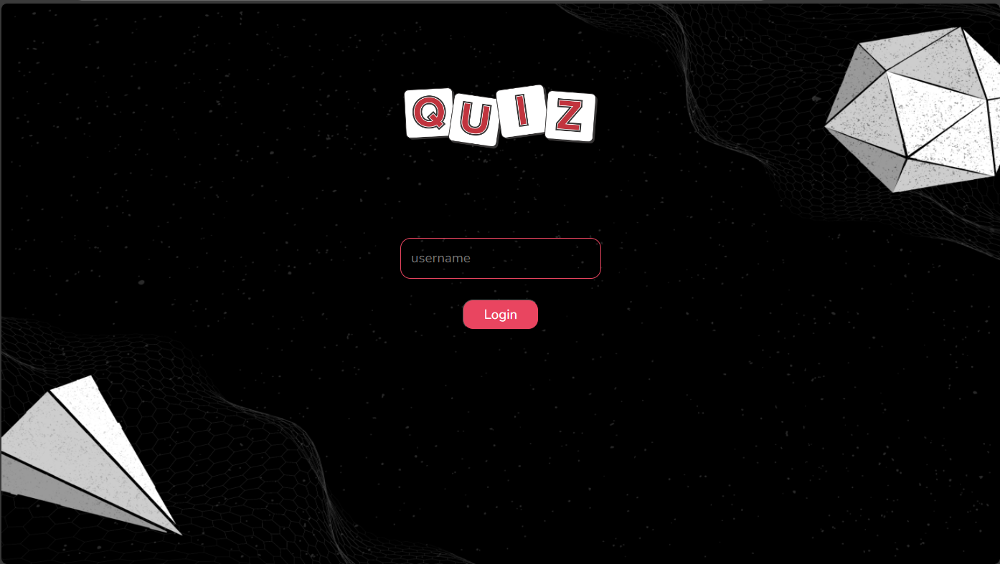
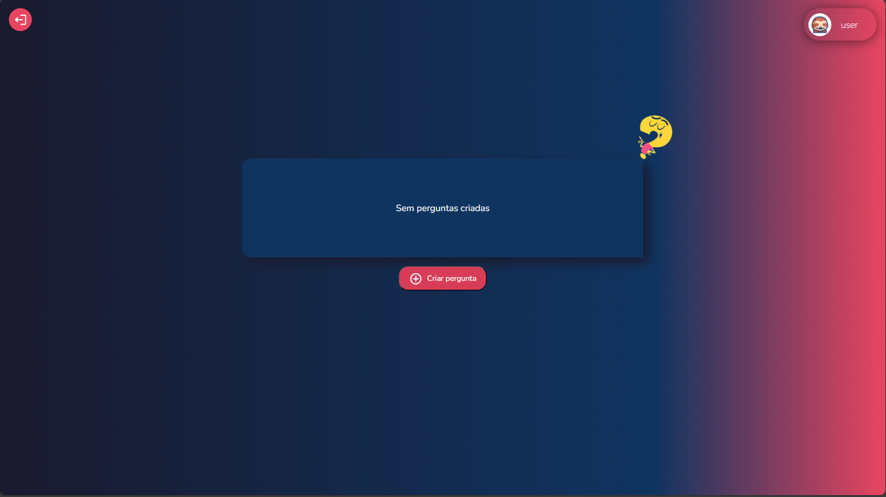
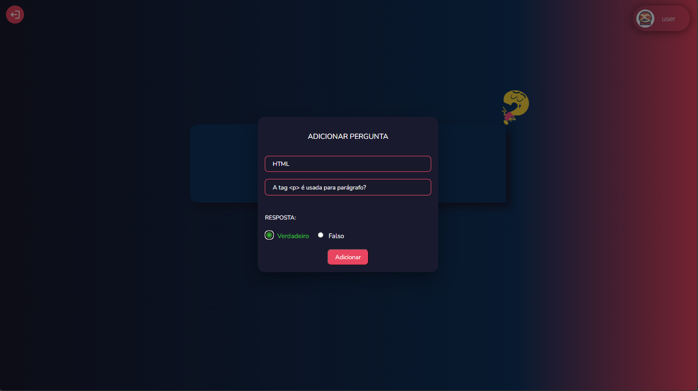
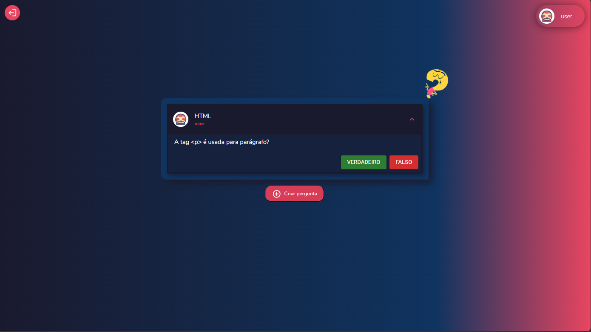

# Aplicativo de Quiz

Este projeto consiste em um aplicativo de quiz onde cada cliente pode criar perguntas com respostas "verdadeiro" ou "falso". Todos os usuários podem votar nas perguntas, inclusive o mesmo cliente, é permitido responder somente uma única vez a pergunta.

## Funcionalidades

1. **Conexão WebSocket**: Ao acessar a página, o cliente estabelece uma conexão WebSocket com o servidor. Neste momento, ainda não pode criar perguntas ou votar, e não recebe perguntas de outros clientes. Apenas um campo para preencher o nome de usuário e um botão "Login" são exibidos.

2. **Entrada do Usuário**: O cliente preenche seu nome de usuário e clica no botão "Entrar". Uma mensagem WebSocket é enviada ao servidor, que valida se o nome de usuário já está em uso. Se válido, o servidor confirma a entrada; caso contrário, uma mensagem de erro é enviada. Se a entrada for válida, a página de quiz é exibida.

3. **Listagem de Perguntas**: Após uma entrada bem-sucedida, o servidor envia uma lista de todas as perguntas já criadas, que são renderizadas na tela. Perguntas criadas no futuro são enviadas uma por vez.

4. **Criação e Votação de Perguntas**: Após a entrada, o cliente pode criar perguntas e votar em perguntas de outros usuários. O servidor gera um ID único para cada pergunta criada e notifica todos os clientes sobre a nova pergunta. Ao votar, todos os clientes são notificados sobre a contagem de votos atualizada.

5. **Liberação de Usuário**: Quando um cliente sai da página (recarrega ou fecha o navegador), o servidor libera o nome de usuário, permitindo que outro cliente use o mesmo nome.

## Estrutura do Projeto

- **Backend**: Servidor Express que serve o front-end estático localizado no diretório `client`.
- **Frontend**: Aplicação React em TypeScript.

## Como Rodar o Projeto

### Pré-requisitos

- Node.js e npm instalados.

### Passos para execução

1. Com o repositório devidamente clonado, crie um arquivo `.env`:

   - Na raiz projeto, crie um arquivo chamado `.env` e copie o conteúdo do arquivo `.env.example` para ele. Este arquivo contém as variáveis de ambiente necessárias para o funcionamento da aplicação.

2. Instale as dependências do servidor:
```
npm install
```

3. Instale as dependências do front, certifique de estar dentro do diretório `/client`:
```
cd /client

npm install
```

4. Faça o `build` necessário no front:
```
npm run build
```

5. Na raiz do projeto, inicie a aplicação com o comando:
```
npm start
```

### Tudo pronto!

- Ao acessar a página incialmente o usuário se depara com a seguinte página de login:


- login realizado com sucesso:


- Modal para criar pergunta:


- Pergunta criada com sucesso:
